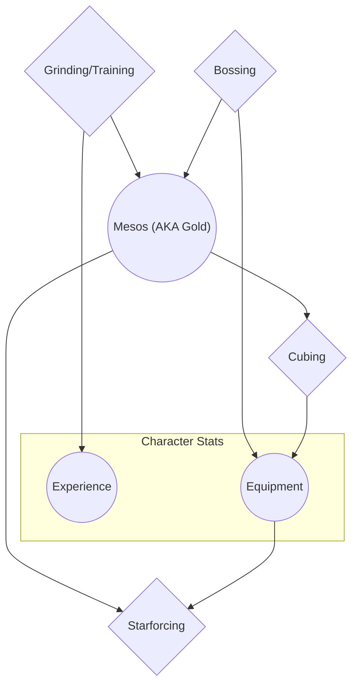

> The goal of this post is to detail my experiences with Maplestory over my life.
> It is a core part of my childhood.
> Even though it might seem insignificant to an outsider, MS is dear to me and I learned many things from it.
> I also want to cement a lesser-known game.
> I also want to show why I love it so much.

# Intro #
MapleStory holds a very dear place in my heart. It is a 2D sidescrolling Korean MMORPG developed by Nexon, initially released in North America in 2005. My brother introduced me to it, which he learned of from a neighbor. I don't remember exactly when I started playing, but there is no doubt it was near the release.

If you were to ask anyone who has played to "describe MapleStory in one word", you would be probably get an assortment of: Exploration, Grinding, Socializing, Childhood, and Nostalgia. For me, it would be Childhood first and Grinding second.

# Art, Design, Music (towns/environments, monster designs, class identities) #
The visual design of MapleStory is absolutely unique and has aged very well. My peeve with most pixel art games is a severe lack of legibility (especially for fonts), which MapleStory does not succumb to. that The style can be best described as pixelated but not pixel art. Back in the day it would be called chibi, nowadays anime-inspired.

Much loved is also the music. Most of the background music (BGM) is orchestral -- filled with flutes, violins, pianos, harps, bells, and drums. What makes the music so memorable is the atmosphere created when combined with the visual design of Maple World's towns and environments.

> [!Clarification]-
> *Maple World* canonically refers to the dimension that was written first in MapleStory's lifetime. The other dimensions are Grandis and Tynerum. I will use *Maple World* to refer to the overall worldbuilding inside the video game MapleStory.

The player navigates the Maple World by traversing through maps. MapleStory is a platformer, so each map is a room filled with platforms. Portals are used to go from one map to the next. I will define Towns as large maps with thematic identity and filled with NPCs. Some maps have monsters in them, which I will call Mob Maps. Towns are connected via pathways of Mob Maps. Narratively, large distances are traversed via planes, boats, and teleportation.

The essence of exploration involves finding some Town and completing Quests that encourage the player to visit the local area. A Quest can ask the player to talk to another NPC, kill specific monsters, visit specific locations, or acquire specific loot.

***shoutout to maplestory lore project***
I'm not a lorehead, but there is a commendable effort to wrap up 2 decades worth of content into a nice, interactive package

## Music ##

I'm curious how someone who hasn't played the game reacts and interprets the music without the artwork, community, experiences, and nostalgia biases.

If Music:
- [MapleStory Music Compilation: THE BEST](https://www.youtube.com/playlist?list=PLARr36qkoiWYoZ4Hyy8pIasv_BkgJyuAL)
- [Classic MapleStory BGM (Pre-Big Bang)](https://www.youtube.com/playlist?list=PLARr36qkoiWa2hl6cXnBxNzU_xxLcQXs0)

## Town, Environment, and Monster Design ##
Each town is unlike another, from a port city to elven forest to floating cloud town.

Many of the towns correspond to the origin story of a class(es).

Pretty much all of the 47 classes correspond to some hometown (~26 unique towns).

Lith Harbor (with NPCs, Blurry): https://i.namu.wiki/i/74YIhsITJok5qUS7FgIoH6zG9yeHPw_8nlfQNzzq3RneycD8OGbf9ohdrP5YBitISCDfPQQMfucNWVVEx-ziziSC08qU60lbfrIV7-46t0aTnQqBN8xhg7fRGlgdgEgH8O_UiCL1zfczkPurkmcV4LHPFXuDZdYBSw13st2-Zi8.webp

Lith Harbor (no NPCs, HQ): https://maplestory.io/api/GMS/255/map/104000000/render

Leafre (no NPCs, HQ): https://maplestory.io/api/GMS/255/map/240000000/render

- Zakum
- Showa being like Yakuza
- Japanese ghosts, Japanese raccoon
- Ellinia Faust
- formula of monster variants (old: stumps, new: chuchu monsters with pattern of 1 variant = 1 map, then mix in last of 3 map)

## Classes ##
MapleStory follows a traditional RPG class system, where you choose your class on creation and are pretty much stuck on a linear path on learning new skills.

- World(?) (adventurer, hero, cygnus knight)
- Branches (warrior, mage)
- Race (human, flora, etc.)

- How diverse each class really is, both in identity/aesthetics and mechanics

# Early Days #
## Memories ##
Sometimes I would no life, sometimes I would be on-and-off-- I didn't really keep track of my playing habits. What I do know is that playing MS was a staple of my childhood.

Just to paint a picture, here's some memories I recall (more in the appendix):
- My first character, a Crossbowman, stuck at level 26 because I kept on dying.
- Going through Mushroom Castle theme dungeon on an Aran while family friends are over.
- Getting phished for the first time at Pirate PQ for "Free NX" (premium in-game currency).
- My first level 120 was my Ultimate Adventurer Paladin, by running R&J PQ with a stranger with familiar hacks.
- Guild with iBobbyAran (college guy from NZ) and another guy Saul.
- Getting verbally bullied by two Spanish-speaking people for no apparent reason. Thanks Google Translate.

## Online Communities ##
Come to think of it, MS was my first introduction to online communities. In-game with Party Quests (Kerning, Romeo & Juliet), Guilds, and party training (Jesters, Lionheart Castle). Out-of-game with some of my school friends and sites like Basilmarket, HiddenStreet, Ayumilove, and Reddit. A common discussion I've seen in current days about why MapleStory (and MMOs in general) used to be so big was the lack of social media and widespread instant messaging. MS *was* Teamspeak, Skype, FB Messenger, Discord, and SMS.

# Gameplay (basic mechanics, grind) #
- Understanding all the complex systems
    - Stats, Damage Formula, Hyper Stats, Inner Ability, V Matrix, Hexa Matrix
    - Scrolls, Potential, Starforce, Gear Progression
    - Dailies, Weeklies
    - Which maps/quests/dungeons are "efficient"
- The simple and mindless grind
- allude to how modern gameplay loop is just an extension of original framework (gear, bossing, mobbing, mules (aka alts))

## sRNG and Gacha ##
- Pretty much invented RNG and Gacha in games (literal Gachapon), and maybe lootboxes.
    - I learned of the word Gachapon from a real-money system in the game called, well, [Gachapon](https://web.archive.org/web/20250321230755/https://maplestory.wiki/GMS/65/npc/9100101).

# Modern times (2022-2024) #
- really played from 2022-2024, intensely like a job

Modern Reboot gameplay loop:

# Quitting #
- Quitting in 2024 beginning due to uncertainty of future updates.
    - Being addicted and trying to fill that hole.
    - change and what it means to stay attached

---

#  WIP notes #

I most likely have over 10000 hours on this game. I only played through Steam in the latter phase and that totals ~2.5k hrs. Keep in mind that AFK-ing is a normal thing.

- Wanting to do everything optimally (minmax) and how that applies to gaming in general, hobbies, and real life
- FOMO and obsession

Private servers

- GMS development following KMS with 6 month lag
- Exposure to KMS, SEA, EU, China, Japan, etc. servers and culture
    - As a kid, I thought SEA was a literal sea, which I also somehow thought was the Atlantic Ocean.
- "Reset" being based on UTC midnight. The server lag being a shared experience. Instead of communicating in timezones, people say "I'm free from +3 to +5".

- Growing up normalized to microtransactions
- so many things I see in mobile and PC games seem (indirectly) derived from MS
    - guild check-ins, attendance, dailies, skin-crossovers, seasonal events, mini-games (e.g. bingo, match 4s), party quests, cubing as re-rolling attributes

---
# Appendix: Misc Memories
- Making new characters to complete a quest for "Attack 60% for Gloves" scrolls for quick money.
- Surfing through the Free Market (FM) rooms to look at cool items.
- Carefully crafting my chat message for selling items to stand out in the FM. This meant appending 7 `@`s, 1 space, and then alternating between a last single `@` or not so that the chat bubble bounced up and down. Part of the spam filter disallowed repeat messages, but somehow alternating between two was okay.
- Laughing at all the dumb inside jokes in Smegas (global chat).
